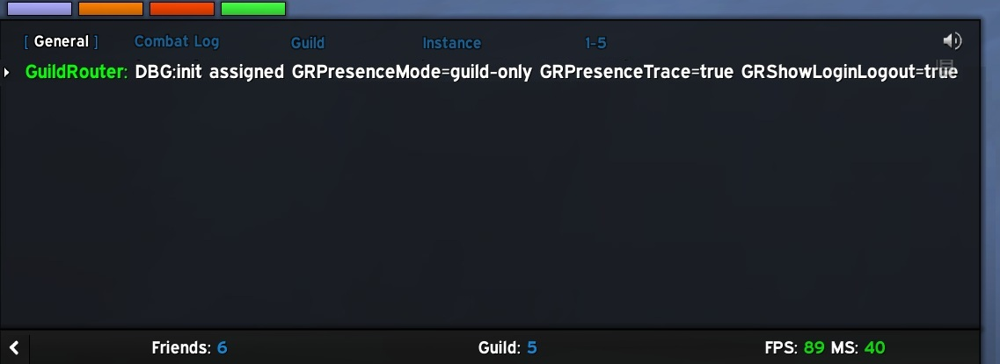
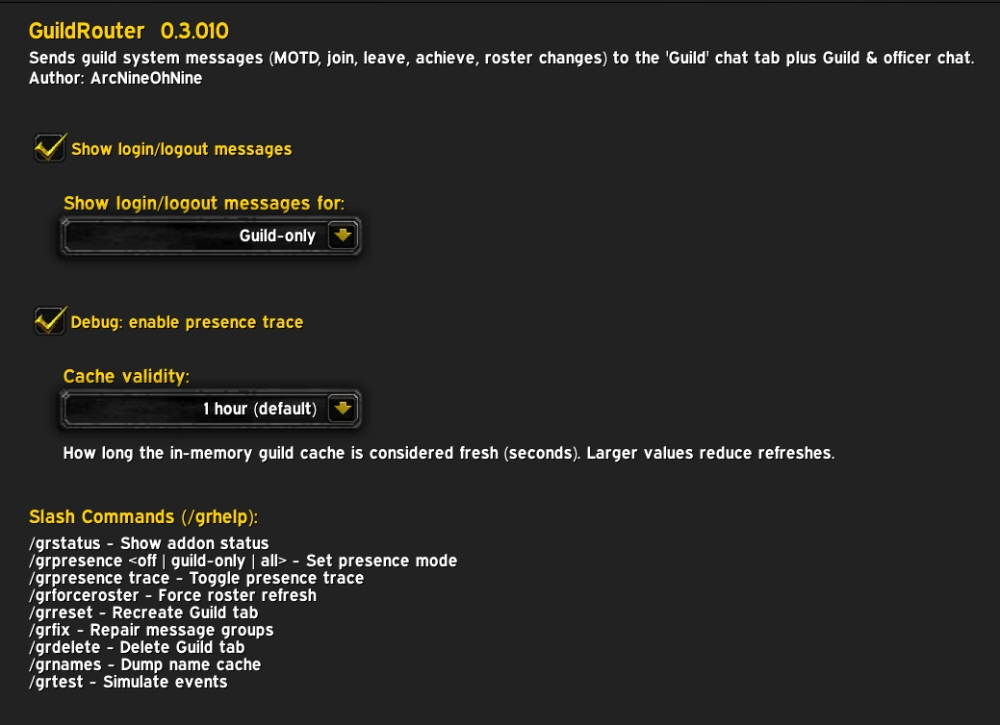
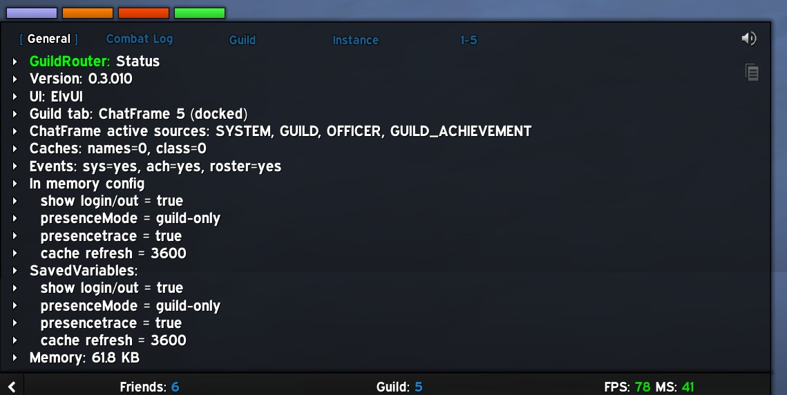

# GuildRouter

A lightweight, high-performance World of Warcraft addon that routes guild events (MOTD, joins/leaves, achievements, roster changes), login/logout, and Guild & Officer chat into a single, dedicated 'Guild' tab.

## Why use this?

**TL;DR** - be better connected with your guild.

Stop losing track of your guild's activity in a flood of trade chat, raid alerts, and world messages. **GuildRouter** intercepts system messages that usually vanish beneath the flood and organises them into a clean, readable stream.

While you can move standard guild chat to a new tab using default Blizzard settings, you lose the context of important events like achievements and roster changes. By default, these are mixed into your main chat frame where they rapidly get buried, especially on busy realms or during intense gaming.

## Why not just make your own “Guild” chat tab?

You can create a custom chat tab and enable Guild, Officer, System, Announce, and Achievement messages but Blizzard’s routing is purely mechanical. It simply dumps raw events into a window with no intelligence, no filtering, and no awareness of guild context.

**GuildRouter** goes far beyond what the default UI can do:

- **Guild‑only achievements:** Blizzard’s Achievement channel shows every nearby player’s achievements, including party and raid members, even when they aren’t in your guild. GuildRouter filters and formats only guild member achievements, keeping the feed focused and noise‑free.

- **Class‑coloured, clickable names:** all system events (joins, leaves, achievements, roster changes) are enriched with class colours, clickable links, and realm‑aware name resolution.

- **Roster‑aware presence logic:** configurable login/logout visibility (guild‑only, all, off) with correct handling of short names and out‑of‑order events.

- **Enhanced roster‑change visibility:** promotions, demotions, rank changes, and note updates are formatted cleanly with class‑coloured, clickable names that are far easier to read than Blizzard’s raw system messages.

- **Presence filtering:** with the SYSTEM channel enabled, GuildRouter suppresses all non‑guild login/logout messages unless you explicitly choose the `all` mode, keeping the Guild tab focused and noise‑free.

- **Anti‑spam engine:** prevents redundant roster refreshes and repeated event processing during rapid‑fire GUILD_ROSTER_UPDATE storms, keeping the addon lightweight and responsive.

- **Consistent, normalised formatting:** ensures all guild‑related events use the same class‑coloured, clickable, realm‑aware format, even when Blizzard sends short names or events arrive out of order.

- **Automatic tab creation, repair, and docking:** /grreset, /grfix, and /grdock ensure the Guild tab always exists, is correctly configured, and stays where you want it.

- **Developer‑grade tools:** /grstatus, /grpresence, /grtest, /grforceroster, and /grnames provide visibility and testing Blizzard doesn’t offer.

Blizzard gives you a bucket. **GuildRouter** gives you a curated, intelligent guild activity feed.

## Key features

- **Set and forget:** install as with any other addon but **no** configuration is necessary
- **Dedicated routing:** automatically creates and manages a "Guild" chat tab
- **Intelligent class colouring:** all player names in join/leave, roster changes, and achievements are class-coloured
- **Interactive links:** player names are fully clickable for whispering, inviting, or inspecting
- **Roster change tracking:** captures promotions, demotions, and note changes (officer & public)
- **MOTD integration:** routes the guild message of the day to the tab upon login and update
- **Anti-spam engine:** uses monotonic game-time tracking to de-duplicate rapid-fire system messages
- **Performance:** built with active name caching, localized globals, and inlined pattern escaping to ensure zero impact on your FPS
- **Efficiency:** consumes trivial memory (567KB with a 773 player guild), only fires on system events
- **Privacy:** all routed messages respect the data source, you can't see more than allowed e.g. officer chat restricted per Guild config

## Installation

1. Move/copy the `GuildRouter` folder to your `_retail_/Interface/AddOns/` or `_classic_/Interface/AddOns/` directory
2. Restart World of Warcraft or logout and login

On load/login:

Types of updates:

## Configuration

The addon requires no setup. When it loads, it looks for a chat tab named **“Guild”**. If it doesn’t exist, **GuildRouter** creates it and assigns Guild, Officer, Guild Announcement, and Blizzard System channels, plus optional login/logout messages, giving you one clean, dedicated tab for all guild activity.

To declutter your chat, disable **Guild Chat**, **Officer Chat**, and **Guild Announce** in your primary windows; these messages are now routed to the Guild tab.

If you are using ElvUI, you may need to drag the ‘Guild’ tab once to your preferred position. After that, if you ever delete or need to reset the tab, you can use `/grreset` and it should retain the previous ordering sequence.

You can modify four values that affect how the addon operates. These are configurable via the standard Blizzard addon UI under `<ESCAPE>->Options->Addons->GuildRouter`.

- **Show login/logout messages**: `enable (default) | disable` display of login and logout messages in the Guild tab
- **Show login/logout messages for**: `Guild-only (default) | off | all` which types of users' login/logout messages will be displayed. Selecting `all` enables anyone in your friends list to be announced to the Guild tab.
- **Debug:enable presence trace**: `enable | disable (default)` turns on detailed diagnostic logging for presence‑related events (login, logout, cache checks, stale‑cache refreshes, throttling decisions, etc.). When enabled, **GuildRouter** prints internal routing decisions to the chat frame so you can see exactly why a message was shown, hidden, or refreshed.
  This option is intended for troubleshooting or for users who want full visibility into how the addon processes presence events. It should normally remain disabled, as it produces a lot of output during busy periods.
- **Cache Validity**: `5 mins | 15 mins | 30 mins | 1 hour (default) | 2 hours` controls how long **GuildRouter** considers its internal guild roster cache “fresh.” A longer validity period means fewer roster scans and lower overhead, which is ideal for normal gameplay, the default of one hour is perfect for most players.
  If you’re actively managing the guild roster (promotions, demotions, invites, removals), you may want to choose a shorter interval so the addon refreshes its data more frequently and reflects changes sooner.

Any changes take effect immediately but are only written to the savedvariables file on successful logout

## Command Line Options

GuildRouter provides several slash commands to manage the Guild tab, control presence announcements, and test events. None are required for normal operation.

- `/grhelp` displays available **GuildRouter** commands.
- `/grstatus` display addon status including memory use.
- `/grpresence [mode]` controls login/logout announcements. Modes: `guild-only` (default), `all`, `off`, or `trace` (debug).
- `/grreset` recreates the Guild tab with correct configuration and docking.
- `/grdelete` deletes the Guild tab **without** confirmation!
- `/grfix` repairs the Guild tab's configuration and docking.
- `/grdock` forces the Guild tab to dock.
- `/grtest join | leave | promote | demote | note | ach` simulates guild events for testing purposes.
- `/grforceroster` force guild roster acquisition/update.
- `/grnames` display cached player→realm mappings.

Status screenshot:

## Technical details

- **System messages:** intercepts, formats and routes guild and related `system` messages
- **Cache system:** to ensure no impact to your gaming, **GuildRouter** caches your guild roster, details below
- **Monotonic timing:** uses `GetTime()` instead of system clock to ensure anti-spam reliability during clock syncs or DST changes
- **Pattern robustness:** uses `gsub` realm-stripping to ensure compatibility with hyphenated names on international realms
- **Deterministic logic:** sequential pattern matching to ensure complex roster changes (like note updates) are captured with 100% accuracy
- **Lookups:** caches the Guild roster for performance

### Cache system

**GuildRouter** uses a smart, event‑driven caching system to keep guild presence routing fast and accurate. Instead of hammering the roster API or rebuilding data every time Blizzard fires a GUILD_ROSTER_UPDATE (which can happen dozens of times per minute), the addon maintains a lightweight cache of guild member names, realms, and classes. This cache is refreshed only when it actually needs to be, on login, or when it becomes stale based on a user‑configurable validity period.

When a presence message arrives (“X has come online”), **GuildRouter** resolves the player’s full name and class instantly from the cache, producing correct clickable links and accurate guild‑membership checks even when Blizzard sends short names or out‑of‑order events. If the cache is stale, the addon requests a roster update in the background, but only if enough time has passed since the last request. All refreshes are throttled and debounced to avoid UI lag, unnecessary work, or API spam.

The result is a system that is instantaneous and rock‑solid: presence messages are always correct, class colours are always accurate, and the addon never stutters or rebuilds more than necessary. It’s engineered to stay fast under heavy event storms, behave deterministically, and keep your chat clean without wasting CPU cycles or impacting your FPS.

## Contributing

Contributions to improve this tool are welcome! To contribute:

1. Fork the repository
2. Create a feature branch
3. Make your changes to the source code or documentation
4. Test with sample data and various input scenarios, see `testcases.txt` as a starting point
5. Submit a pull request with a clear description of the improvements

Please ensure your changes maintain compatibility with existing variable formats and follows Lua best practices.

## Support

This tool is unsupported and may cause objects in mirrors to be closer than they appear etc. Batteries not included.

## License

This program is free software: you can redistribute it and/or modify it under the terms of the GNU General Public License as published by the Free Software Foundation, either version 3 of the License, or (at your option) any later version.

This program is distributed in the hope that it will be useful, but WITHOUT ANY WARRANTY; without even the implied warranty of MERCHANTABILITY or FITNESS FOR A PARTICULAR PURPOSE. See the GNU General Public License for more details.

You should have received a copy of the GNU General Public License along with this program. If not, see <https://www.gnu.org/licenses>.

Copyright (C) 2026 ArcNineOhNine
