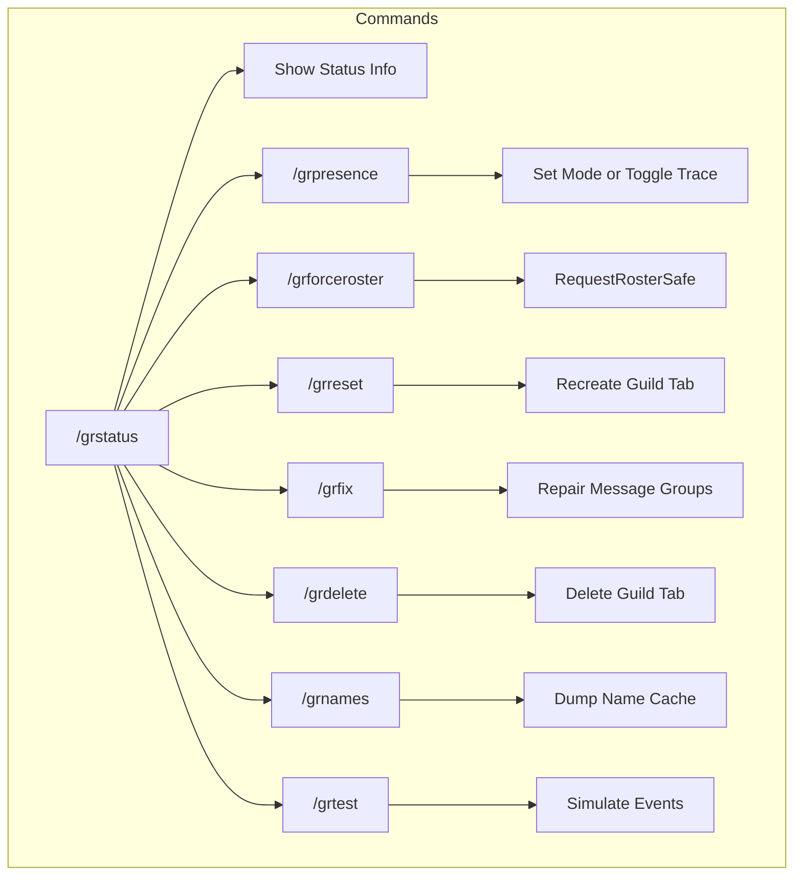

# GuildRouter slash commands

```mermaid
flowchart TD
    subgraph Commands
      G0["/grstatus"] --> G1[Show Status Info]
      G0 --> G2["/grpresence"]
      G2 --> G3[Set Mode or Toggle Trace]
      G0 --> G4["/grforceroster"]
      G4 --> G5[RequestRosterSafe]
      G0 --> G6["/grreset"]
      G6 --> G7[Recreate Guild Tab]
      G0 --> G8["/grfix"]
      G8 --> G9[Repair Message Groups]
      G0 --> G10["/grdelete"]
      G10 --> G11[Delete Guild Tab]
      G0 --> G12["/grnames"]
      G12 --> G13[Dump Name Cache]
      G0 --> G14["/grtest"]
      G14 --> G15[Simulate Events]
    end

```
