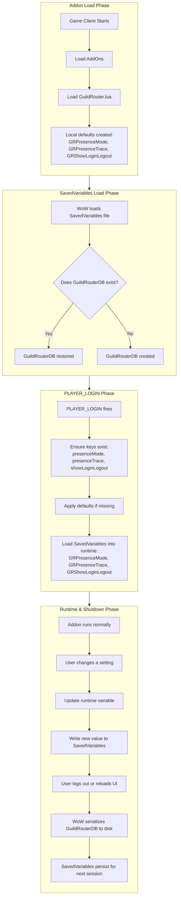

# GuildRouter SavedVariables handling

```mermaid
flowchart TB

    %% ===========================
    %%  ADDON LOAD PHASE
    %% ===========================
    subgraph LOAD_PHASE ["Addon Load Phase"]
        direction TB
        A0["Game Client Starts"]
        A1["Load AddOns"]
        A2["Load GuildRouter.lua"]
        A3["Local defaults created:<br/>GRPresenceMode, GRPresenceTrace, GRShowLoginLogout"]

        A0 --> A1
        A1 --> A2
        A2 --> A3
    end

    %% ===========================
    %%  SAVEDVARIABLES LOAD PHASE
    %% ===========================
    subgraph SV_LOAD ["SavedVariables Load Phase"]
        direction TB
        A4["WoW loads SavedVariables file"]
        A5{Does GuildRouterDB exist?}
        A6["GuildRouterDB restored"]
        A7["GuildRouterDB created"]

        A4 --> A5
        A5 -->|Yes| A6
        A5 -->|No| A7
    end

    %% ===========================
    %%  PLAYER_LOGIN PHASE
    %% ===========================
    subgraph PLAYER_LOGIN ["PLAYER_LOGIN Phase"]
        direction TB
        B0["PLAYER_LOGIN fires"]
        B1["Ensure keys exist:<br/>presenceMode, presenceTrace, showLoginLogout"]
        B2["Apply defaults if missing"]
        B3["Load SavedVariables into runtime:<br/>GRPresenceMode, GRPresenceTrace, GRShowLoginLogout"]

        B0 --> B1
        B1 --> B2
        B2 --> B3
    end

    %% ===========================
    %%  RUNTIME & SHUTDOWN PHASE
    %% ===========================
    subgraph RUNTIME ["Runtime & Shutdown Phase"]
        direction TB
        C0["Addon runs normally"]
        C1["User changes a setting"]
        C2["Update runtime variable"]
        C3["Write new value to SavedVariables"]
        D0["User logs out or reloads UI"]
        D1["WoW serializes GuildRouterDB to disk"]
        D2["SavedVariables persist for next session"]

        C0 --> C1
        C1 --> C2
        C2 --> C3
        C3 --> D0
        D0 --> D1
        D1 --> D2
    end

    %% STACK PHASES VERTICALLY
    LOAD_PHASE --> SV_LOAD
    SV_LOAD --> PLAYER_LOGIN
    PLAYER_LOGIN --> RUNTIME


```
