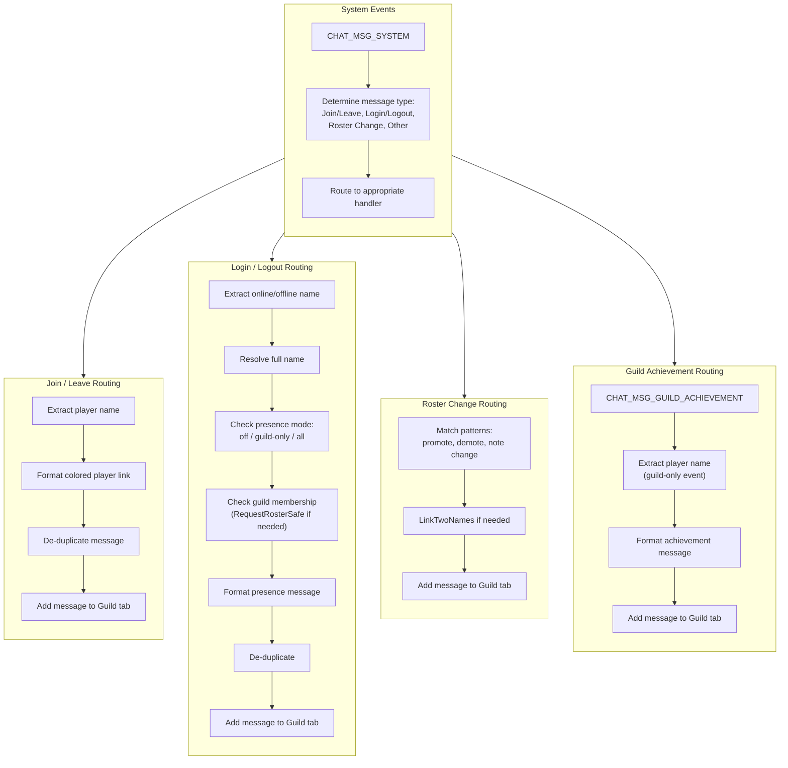

# GuildRouter event routing

```mermaid
flowchart TB

    %% ===========================
    %%  SYSTEM EVENTS
    %% ===========================
    subgraph SYSTEM_EVENTS ["System Events"]
        direction TB

        S0["CHAT_MSG_SYSTEM"]
        S1["Determine message type:<br/>Join/Leave, Login/Logout,<br/>Roster Change, Other"]
        S2["Route to appropriate handler"]

        S0 --> S1 --> S2
    end

    %% ===========================
    %%  JOIN / LEAVE HANDLING
    %% ===========================
    subgraph JOIN_LEAVE ["Join / Leave Routing"]
        direction TB

        J0["Extract player name"]
        J1["Format colored player link"]
        J2["De-duplicate message"]
        J3["Add message to Guild tab"]

        J0 --> J1 --> J2 --> J3
    end

    %% ===========================
    %%  LOGIN / LOGOUT HANDLING
    %% ===========================
    subgraph LOGIN_LOGOUT ["Login / Logout Routing"]
        direction TB

        L0["Extract online/offline name"]
        L1["Resolve full name"]
        L2["Check presence mode:<br/>off / guild-only / all"]
        L3["Check guild membership<br/>(RequestRosterSafe if needed)"]
        L4["Format presence message"]
        L5["De-duplicate"]
        L6["Add message to Guild tab"]

        L0 --> L1 --> L2 --> L3 --> L4 --> L5 --> L6
    end

    %% ===========================
    %%  ROSTER CHANGE HANDLING
    %% ===========================
    subgraph ROSTER_CHANGES ["Roster Change Routing"]
        direction TB

        R0["Match patterns:<br/>promote, demote, note change"]
        R1["LinkTwoNames if needed"]
        R2["Add message to Guild tab"]

        R0 --> R1 --> R2
    end

    %% ===========================
    %%  GUILD ACHIEVEMENTS
    %% ===========================
    subgraph GUILD_ACHIEVEMENTS ["Guild Achievement Routing"]
        direction TB

        A0["CHAT_MSG_GUILD_ACHIEVEMENT"]
        A1["Extract player name<br/>(guild-only event)"]
        A2["Format achievement message"]
        A3["Add message to Guild tab"]

        A0 --> A1 --> A2 --> A3
    end

    %% ===========================
    %%  PHASE CONNECTIONS
    %% ===========================
    SYSTEM_EVENTS --> JOIN_LEAVE
    SYSTEM_EVENTS --> LOGIN_LOGOUT
    SYSTEM_EVENTS --> ROSTER_CHANGES
    SYSTEM_EVENTS --> GUILD_ACHIEVEMENTS


```
