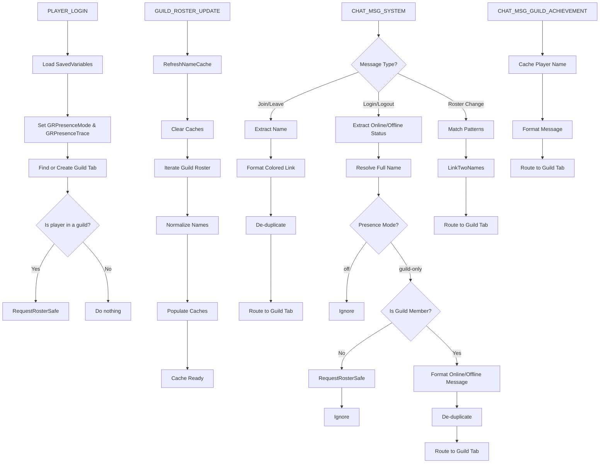

# GuildRouter execution flowchart

```mermaid
flowchart TD
    A0[PLAYER_LOGIN] --> A1[Load SavedVariables]
    A1 --> A2[Set GRPresenceMode & GRPresenceTrace]
    A2 --> A3[Find or Create Guild Tab]
    A3 --> A4{Is player in a guild?}
    A4 -->|Yes| A5[RequestRosterSafe]
    A4 -->|No| A6[Do nothing]

    B0[GUILD_ROSTER_UPDATE] --> B1[RefreshNameCache]
    B1 --> B2[Clear Caches]
    B2 --> B3[Iterate Guild Roster]
    B3 --> B4[Normalize Names]
    B4 --> B5[Populate Caches]
    B5 --> B6[Cache Ready]

    C0[CHAT_MSG_SYSTEM] --> C1{Message Type?}

    C1 -->|Join/Leave| C2[Extract Name]
    C2 --> C3[Format Colored Link]
    C3 --> C4[De-duplicate]
    C4 --> C5[Route to Guild Tab]

    C1 -->|Login/Logout| D0[Extract Online/Offline Status]
    D0 --> D1[Resolve Full Name]
    D1 --> D2{Presence Mode?}
    D2 -->|off| D3[Ignore]
    D2 -->|guild-only| D4{Is Guild Member?}
    D4 -->|No| D5[RequestRosterSafe]
    D5 --> D6[Ignore]
    D4 -->|Yes| D7[Format Online/Offline Message]
    D7 --> D8[De-duplicate]
    D8 --> D9[Route to Guild Tab]

    C1 -->|Roster Change| E0[Match Patterns]
    E0 --> E1[LinkTwoNames]
    E1 --> E2[Route to Guild Tab]

    F0[CHAT_MSG_GUILD_ACHIEVEMENT] --> F1[Cache Player Name]
    F1 --> F2[Format Message]
    F2 --> F3[Route to Guild Tab]

```
